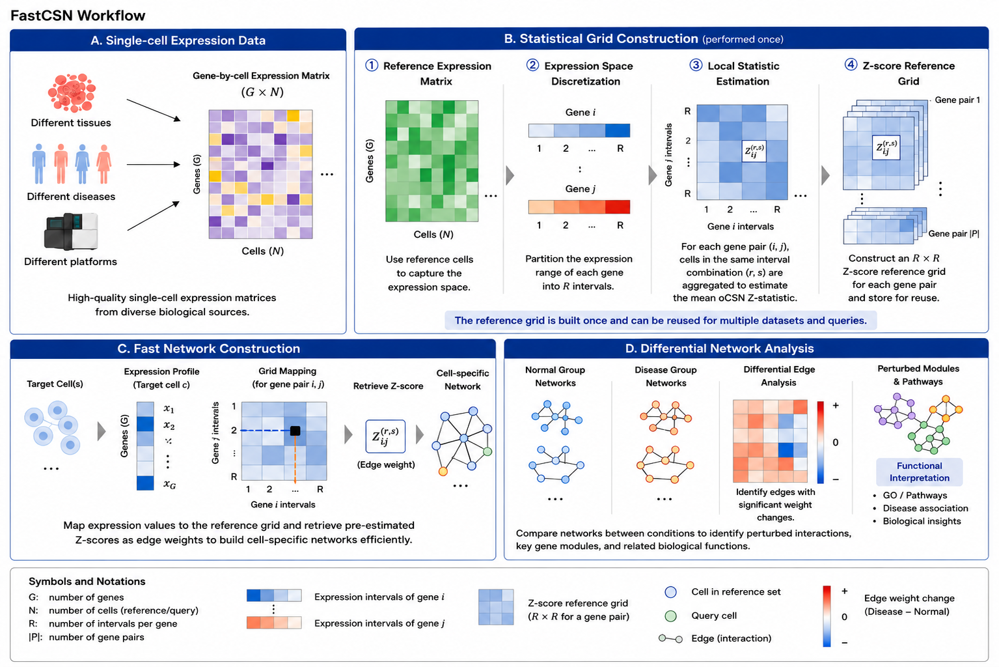

# FastCSN

FastCSN accelerates cell-specific network construction by replacing repeated local oCSN calculations with a precomputed expression-grid lookup. This repository contains the original research scripts used for FastCSN, oCSN, locCSN/metacell comparison, scalability experiments, sensitivity analysis, ASD differential network analysis, and figure generation.

The code in this repository was organized from the local project at `F:\fast_CSN\pythonProject`. The previous generated package-style code has been removed so that the GitHub repository reflects the actual analysis code used for the manuscript.



## Repository layout

- `fastcsn.py`: FastCSN grid precomputation and lookup implementation.
- `ocsn_official.py`: oCSN and baseline CSN construction utilities.
- `loccsn_metacell.py`: locCSN/metacell aggregation implementation.
- `predata.py` and `application.py`: ASD vs Control differential network analysis workflow.
- `experiment_accuracy.py`: accuracy comparison against oCSN and other CSN baselines.
- `experiment_sensitivity.py`: FastCSN grid-resolution sensitivity experiments.
- `run_AD.py`, `run_covid.py`, `run_mouse.py`: scalability and dataset-specific runs.
- `paper/`: final manuscript and the four main figure files.
- `results/`: CSV/TXT analysis outputs from benchmark and ASD differential network runs.
- `figures/`: generated benchmark, sensitivity, and downstream figures.
- `data/`: data placement instructions. Raw datasets are not committed.

## Installation

Python 3.9+ is recommended. The original local environment used Scanpy, SciPy, scikit-learn, statsmodels, seaborn, matplotlib, joblib, tqdm, and networkx.

```bash
python -m venv .venv
.venv\Scripts\activate
pip install -r requirements.txt
```

On Linux/macOS, use `source .venv/bin/activate` instead of the Windows activation command.

## Quick checks

Compile the core scripts:

```bash
python -m py_compile fastcsn.py ocsn_official.py loccsn_metacell.py
```

Run a quick benchmark script after placing the required matrix files:


## Data paths

All scripts expect the required datasets to be placed in the `data/` directory at the project root. 
If you need to use a different location, edit the `DATA_PATH` / `DATA_DIR` constants near the top of each script.
See `data/README.md` for the expected dataset layout.

## Main analysis scripts

```bash
python experiment_accuracy.py
python experiment_sensitivity.py
python run_AD.py
python run_covid.py
python run_mouse.py
python predata.py
```

Large experiments can be slow because oCSN is used as a reference baseline during precomputation and evaluation.

## Manuscript figures

The four key manuscript figures are stored in `paper/figures/`:

- `Figure_1_FastCSN_workflow.png`
- `Figure_2_performance_summary.svg`
- `Figure_3_sensitivity_or_accuracy.svg`
- `Figure_4_ASD_top20_DNG_network.svg`

## License

This repository keeps the MIT license file that was already present in the local FastCSN folder.
